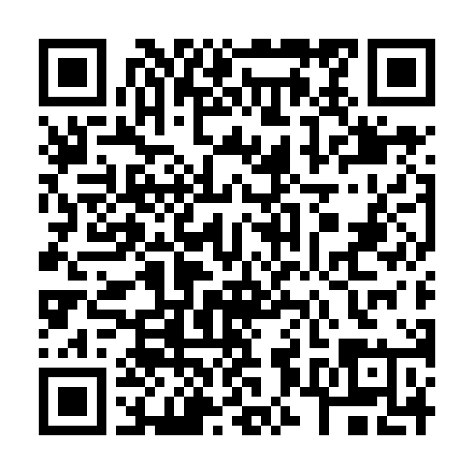

# 🧠 Parkinson Care — Android app

A native Android app for people living with Parkinson's: **medication reminders with real, full-screen voice alarms that fire even when the phone is locked or the app is closed**, plus a daily well-being diary.

## 📥 Install

**[⬇ Download the latest APK](https://github.com/Ljupcho1982/parkinson-care-android/releases/download/latest/parkinson-care.apk)** — or scan:

   
  <em>Scan with your phone camera to download &amp; install</em>

1. Open the link / scan the QR on your phone → it downloads `parkinson-care.apk`.
2. Tap the file → allow **“install unknown apps”** → **Install**.
3. On first launch allow **Notifications**, **Alarms & reminders**, and **Display over other apps**.
4. For reliability: **Settings → Apps → Parkinson Care → Battery → Unrestricted**.

## ✨ Features
- ⏰ **Full-screen alarm** when a dose is due — giant pill name, looping alarm sound, vibration, and a **spoken voice** reminder (English / Macedonian) — works when the app is closed or the phone is locked.
- ✅ One-tap dose logging + adherence tracking
- 📝 Daily well-being diary (tremor, stiffness, energy, sleep, notes) with JSON/CSV export
- 🔁 Alarms re-arm automatically after a reboot
- 🔒 All data stays on the device

## 🛠 Build
Built with **Capacitor 6** (web UI) + a native Java alarm engine (`AlarmManager`, full-screen `AlarmActivity`, `TextToSpeech`). CI builds and publishes the APK via GitHub Actions (`.github/workflows/android.yml`) on every push to `main`.

## ⚕️ Disclaimer
This app helps you **track and remember** — it does **not** give medical advice. Never change your medication or schedule without talking to your doctor or neurologist.
